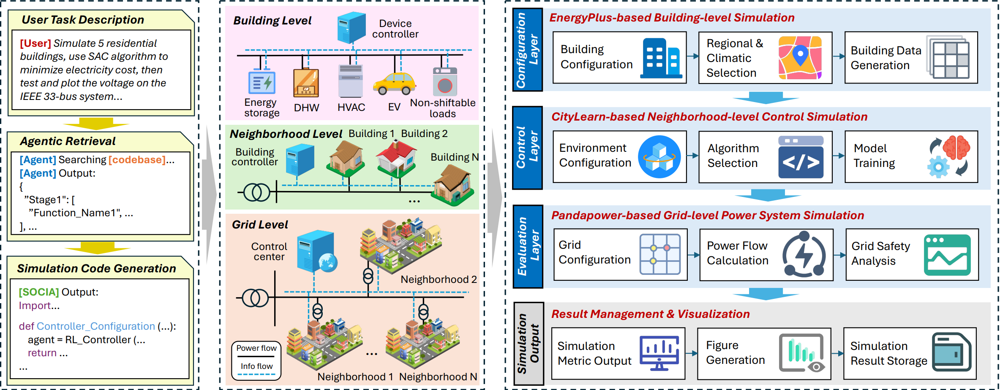

# AutoB2G


AutoB2G is a building-grid co-simulation framework that integrates building-level energy control ([CityLearn V2](https://www.tandfonline.com/doi/full/10.1080/19401493.2024.2418813)) with power system analysis, and leverages the large language model-based [SOCIA](https://arxiv.org/abs/2505.12006) framework to enable natural language-driven simulation automation. It supports coordinated evaluation of demand response strategies and their impact on distribution grid performance.

<p align="center">
  
</p>


---

## 🔍 Overview

This project integrates:

- 🏢 **CityLearn** – Building-level energy simulation and control
- ⚡ **Pandapower & OpenDSS** – Distribution grid power flow simulation
- 🤖 **Reinforcement Learning** – Data-driven control strategies
- 📈 **Grid Performance Optimization** – Voltage regulation
- 🔎 **Power System Analysis** – Grid robustness evaluation

---

## 🚀 Features

- Language–driven automated simulation
- Building dataset generation
- Multi-building control via reinforcement learning
- Power flow simulation
- Voltage regulation strategy optimization
- Power system analysis
- Visualization and CSV export

---

## ▶️ Usage

### 1️⃣ Configure API Key

Before running the framework, add your API key in:

```
keys.py
```

Example:

```python
OPENAI_API_KEY = "your_api_key_here"
```

---

### 2️⃣ Provide Natural Language Instruction

Inside `run.py`, provide a natural language instruction describing the experiment.  
For example:

```
Run a 25-building co-simulation using the default building-grid mapping. Identify the nodes with the highest voltage sensitivity, redistribute the buildings to reduce voltage violations, rerun the simulation, and compare the grid KPIs before and after redistribution. Save all allocation configurations, voltage statistics, and comparison plots.
```

The SOCIA framework will:

1. Parse the natural language instruction
2. Retrieve from the codebase
3. Generate the corresponding simulation workflow  
4. Execute CityLearn and grid-side simulations  
5. Compute evaluation metrics  
6. Output plots and CSV files  

---

### 3️⃣ Run the Framework

Execute:

```bash
python run.py
```

---

## 📤 Output

The framework generates outputs based on user-defined instructions. Depending on the experiment setup, results may include:

- Bus voltage magnitude time-series  
- Line loading time-series
- Building metrics  
- Grid metrics

Results are automatically saved to:

```
output_grid/
```

